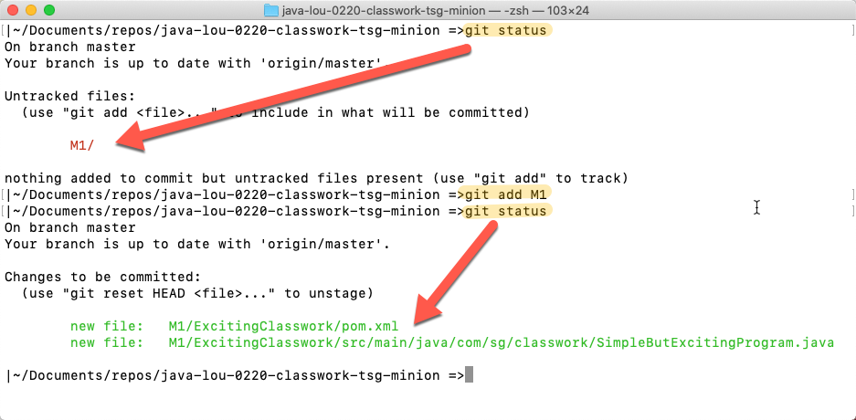

# TSG Apprentice Summative Repo
This is the repository where you should store your solution for your mastery project.

## **Common Steps / Solo Workflow**

Once you have cloned this repository cloned - here is a reminder of the workflow you'll follow (for the most part).

1.  Make some changes.
    *   This means new files, or modifying existing files already in the repository.
    *   Save all the changes and get ready for staging.
2.  Stage your changes w/ _git add_
    *   Run **git status**
    *   If you observe 'red' text files - it means you have some things to add!
_

Expand for visual example...

_
    *   use the command **git add --all .** to add all files to the staging area.
3.  Commit your staged files w/ _git commit_
    *   Run **git status**
    *   If you observe 'green' text files - it means you staged your changes, and are ready to commit!
_

Expand for visual example...

_
    *   use the command **git commit -m "A message about your changes"** to commit your files to a save point.
4.  Push your changes to the server with _git push_
    *   Run **git status**
    *   If you have no red, or green text and just a note about you being ahead by a # of commits - it's time to push!
_

Expand for visual example...

_
    *   use the command **git push origin master** to push all your changes up to the server repository.
5.  Check your status w/ _git status_ & start making new changes!
    *   Run **git status**
    *   If it says you're up to date w/ the server, you're good to start coding again!
_

Expand for visual example...

_
    *   When you have new changes to save, go back to step 1, and add/commit/push all over again!

# Stuck on Git?
Here are some other resources you might want to 'git'...

*   [Git Tower's Cheat Sheet](https://www.git-tower.com/blog/git-cheat-sheet/)
*   [Git Basics](https://git-scm.com/book/en/v2/Getting-Started-Git-Basics)
*   [Command Reference](https://git-scm.com/docs)
*   [Atlassian's Git Readings](https://www.atlassian.com/git/tutorials/what-is-version-control)
*   [Tutorial Point - Git Lifecycle](https://www.tutorialspoint.com/git/git_life_cycle.htm)
*   [Learn Enough Git to be Dangerous!](https://www.learnenough.com/git-tutorial)